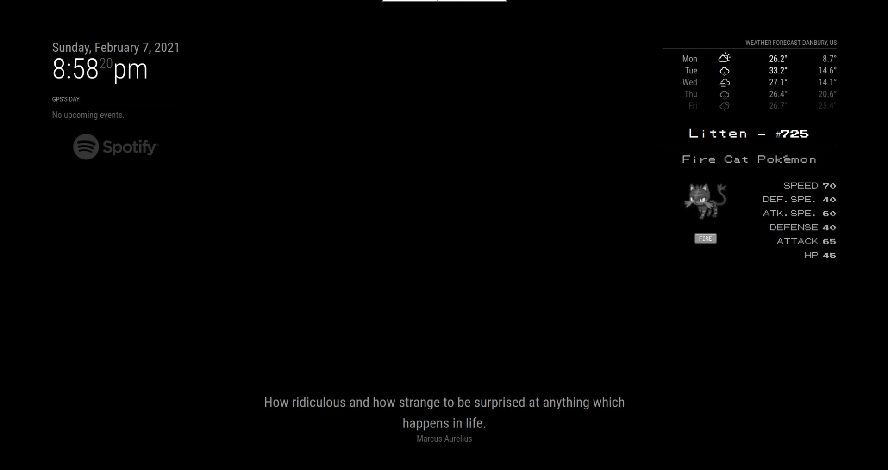

# MMM-Stoic-quote-of-the-day

This is a module for the [MagicMirror²](https://github.com/MichMich/MagicMirror/).

Shows a random quote from https://stoicquotesapi.com/ once a day.



## Using the module

Clone this repo into ~/MagicMirror/modules directory. 

```bash
git clone https://github.com/madebygps/MMM-Stoic-quote-of-the-day.git
```

Change directory to module folder 
```bash
cd MMM-Stoic-quote-of-the-day
```
Install required libraries

```js
npm install
```

To use this module, add the following configuration block to the modules array in the `config/config.js` file, here is an example:
```js
{
    module: 'MMM-Stoic-quote-of-the-day',
    position: "lower_third",
    config: {
        updateInterval: "1d"             
    }
} 
```

## Configuration options

| Option           | Description
|----------------- |-----------
| `updateInterval`        | Time between each update of the quote. Composed by an integer followed by a letter "s" or "m" or "h" or "d" for second, minute, hour or day. Default is every day.

Example of updateInterval:

- 1d: update the quote every day
- 1h: update the quote every 1 hour
- 10m: update the quote every 10 minutes
